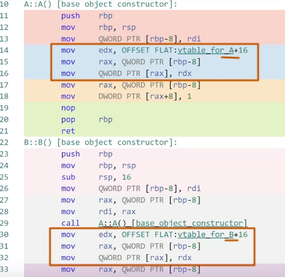
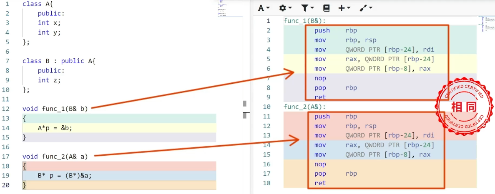
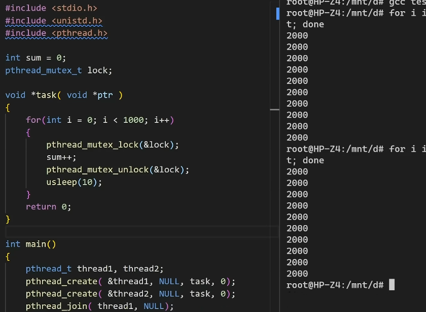
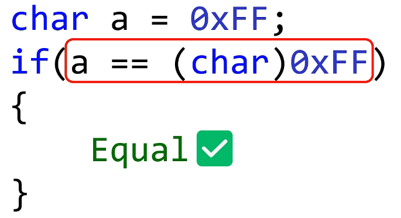
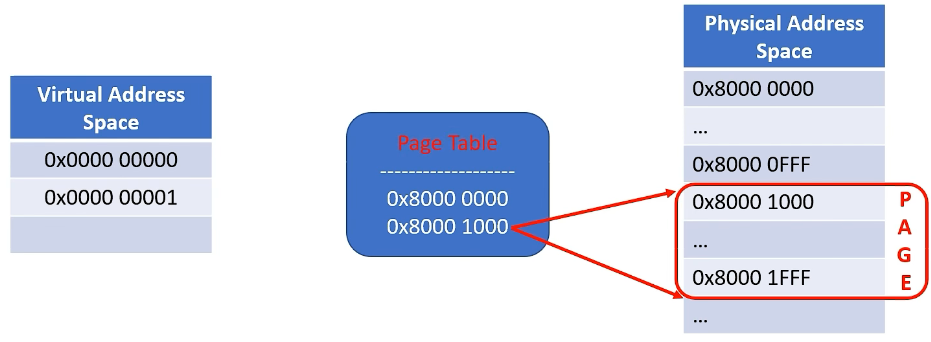

#### 1.main函数

从底层实现上看 main和普通函数没有任何区别（堆栈 中断向量表 硬件初始化）

```c++
！gcc -nostartfiles -efunc test.c//指定test.c中的func作为起点
```

a. cpu面前函数没有主次之分，main和普通函数完全相同

b. main只是大多数程序的默认起点，但却不是非它不可。任何函数都可以被设置成程序的起点

#### 2.变量


（rip寄存器存放cpu下一条指令的地址）

定义变量的过程就是向下（地段地址方向）拓展函数堆栈（rbp）的过程

1.每个变量都对应一个内存地址，变量类型决定其占用内存空间的长度


2.全局变量，静态变量对应的内存地址是全局唯一的，不会随程序的运行而变化


3.局部变量（栈变量），变量的值有有有效期的限制，变量的地址也会因为不同的线程调用而不同，即便在同一个线程也会因为调用轨迹的不同而不同


函数指针在汇编层也就是一个普通变量。

#### 3.this指针


1.普通函数和成员函数在汇编层是完全一致的，

2.this指针就是这个普通函数的参数（所有成员函数都有一个this指针）

3.this指针是每一个成员函数必备的默认参数，C++语法将其隐藏起来

（普通参数：this指针）

4.调用部分：调用普通函数和调用成员函数的汇编指令是一致的（输入this指针就是输入对象test的地址）

对象调用成员函数时，**将自己的地址当做**this指针输入给成员函数

#### 4.构造函数


1.在没有继承的情况下，构造函数和普通函数没有任何区别。


2.添加一个简单地派生类B，对比A,B的构造函数，B的构造函数多了3条指令，前两条是输入隐藏参数this指针，第3条指令是调用A的构造函数（派生类的构造函数总会调用基类构造函数，只是基本的函数调用）。



3，将类A的普通函数变成虚函数，A，B的构造函数都会出现3条指令，即纪录虚函数表的地址，A的构造函数只会纪录A的虚函数表地址（地址存在this指向的位置），B的构造函数只会纪录B的虚函数表地址（地址存在this指向的位置）。从而保证A和B的对象实例在调用虚函数的时候能区分你我。即动态绑定。

所有的虚函数绑定早在构造函数的时候就定好了


虚函数表

#### 5.虚函数


1.虚函数在虚函数体上跟普通成员函数在汇编指令上是完全一致的，都会夹带一个隐藏参数this指针


2.在调用时，大部分是相同的，比如输入隐藏参数this指针。惟一的区别是，调用普通函数时，call指令的目标地址在编译阶段就确定了，即静态绑定。但调用虚函数的时候，call指令只能根据rdx寄存器的值来确定函数的位置，即所谓的动态绑定。


所谓的动态绑定，如图所示的三条指令。


3.当类A有虚函数的时候，类A会生成一个隐藏成员变量V（vptr) (起名，指针变量），V存放虚函数表的内存地址，根据偏移，可以得到要执行的vfunc_1的地址，将其存在寄存器rdx里面，随后一条call rdx指令，便完成了一个虚函数的调用。


4，如果说类的成员函数会夹带隐藏参数this指针，类的构造函数会夹带隐藏变量V，其初始化：在A的构造函数中，把V初始化成类A的虚函数表地址。尽管没有写构造函数，编译器还是会给我们生成一个默认的构造函数。它一定必须帮我完成隐藏变量V的初始化。


5.当A如果有派生类B的话，那么隐藏变量V会在B的构造函数中，被初始化成B的虚函数表地址从而保证A.B的虚函数相互独立。


但考虑到派生类B的构造函数还会调用基类A的构造函数，因此，变量V一会会被初始化成类A的虚函数表，一会又会被初始化成类B的虚函数表，为了避免晕，往往会禁止在构造函数里面调用虚函数。


6.最后，调用任何虚函数的套路，都是一样的。惟一的区别的是要根据他们在虚函数表的位置设置正确的偏移量。

虚函数的出现函数指针的使用率大大降低。避免了大量的函数指针。

#### 6.多态



以上1.基类的指针指向子类的对象。2.子类的对象指向强制转换成子类的基类对象。两者完全相同。


在汇编阶段的多态，只是一种合法的类型转换。甚至于以上int类型的强制转换，也是一模一样。

无论哪种类型转换都是不安全的。唯独多态的类型转换是安全的。


对于基类A的结构，起始的四个字节分给x，随后的四个字节分配给变量y，如果有虚函数的话，x，y同时上移四个字节，吧起始的四个字节留给隐藏变量V，用于存放类A的虚函数表地址。对于类B，首先把基类A的结构全盘复制过来，如果有虚函数，就把隐藏变量V改为类B的虚函数表地址，最后在末尾增加四个字节分配给变量z。

以上，如果不考虑派生类B特有的变量Z，派生类B的结构和基类A是完全相同的。完全可以把派生类B降级成基类A来使用。


以上func_1就是把派生类B的对象降级成基类A的对象再使用，这便是：**代码复用**

相反，函数func_2把基类A升级成派生类B来使用，显然不行。

因为基类A没有给变量z预留空间。即使func_2能够通过，但一旦访问变量z就会越界，读写到不属于变量z的内存空间，随后不是程序崩溃就是运行异常。


多态仅仅是把派生类降级成基类使用以外，虽然复用了基类的共性（变量/函数），但是没有体现自己的特性。


如何体现其特性？  **虚函数**

以上，如果我们要访问类B的特有变量z，可以在类B定义一个特有的虚函数，至于类A没有特定变量z，可以给其一个返回-1的空函数，或者纯虚函数。

根据动态绑定的实现原理，无论指针p是什么类型，当p指向类A的对象时，会调用类A特有的虚函数，当p指向类B的对象时，会调用类B特有的虚函数。

即多态的精髓，调用相同名称的函数，会根据对象的实际类型执行不同的函数版本。即类B不仅可以复用基类A的属性（变量/函数），还可以扩展自己的特性。

如此这般：

1.多态会用基类指针指向派生类对象，

2.多态会利用派生类的结构特点复用基类的属性（变量/函数）

3.多态会利用虚函数来扩展派生类的特性

#### 7.goto


#### 8.数组越界 | 堆栈溢出


首先数组越界也看向那个方向越界，向低端地址（下）的越界有些情况是看似安全的。如图越界的-1和-2相当于偷偷拓展了两个变量c和d，之所以暂时安全是因为越界元素所在的内存是一块：无主之地（**空闲堆栈**），此时的读写操作不会影响到任何人。

如果说数组向地段地址越界是开疆拓土的话，向高端地址越界就是调转枪头的内卷（**main函数堆栈**）


越界


func_1对应的堆栈上方，这里存放引导cpu跳转的地址信息，cpu靠这个地址信息回到调用者main函数那边。显然a[3]=0，让cpu跳转到0必定导致cpu异常。


如果要修正的话，恢复到原来的地址就好了。

如图main调完func_1之后，cpu只有返回到0x401185这个地址才能继续执行main函数的其他操作。

所以：

数组向高端地址越界，会修改堆栈中的关键数据，程序会立刻崩溃。数组向地段地址越界，程序不会马上崩溃。

#### 9.指针变量 | 数组指针 | 野指针


以上四个完全一致。

无论是什么类型的指针变量，对指针变量的读写，跟普通变量，没有任何区别。

共性：所谓的 指向，不过是在描述指针变量的值是多少。就变量读写而言，指针变量跟普通变量没有任何区别。

特性：最显著的特性就是：*操作

给指针变量赋初值，一定是合法合理的内存地址，一旦非法，程序会崩或者野指针。

总结：

1.指针变量也是变量，读写操作跟普通变量完全一致

2.不同的是，普通变量的值多用于数学计算，而指针变量的值，往往用来定位内存（int* p）,它可以是：某个变量的地址，常量的地址const，cpu寄存器的地址，还可以是受保护的地址空间

3.指针变量的*****操作*p是对内存的读写操作，他可以改变：变量的值，常量的值const，cpu寄存器的值，还可以是尝试受保护的地址空间（但有MMU保护机制）

4.指针变量做+-操作，也就是在：地址偏移 + 步长。

#### 10.指针 | 万物皆“指针”

万物皆地址，那么普通变量也可以进行指针操作码 * 和 ->


如图，1借用指针变量p，通过*****操作来给变量a赋值，2不借助指针变量直接对变量a的地址进行*****操作来给变量赋值

只要知道变量a的地址，普通变量也能进行指针*操作，而且省掉了指针变量的开销

由函数3可以知道，变量读写在汇编层次就是对变量地址的指针*操作（变量就是内存地址的别名）


同样，也可以通过指针的->操作对类成员变量赋值

万物皆是指针

#### 11.volatile

volatile放在变量前说明这个变量是易变的，不稳定的

编译器会把它认为值不会改变的变量当常量对待，以此换取大幅度的优化，并缩减汇编指令，而volatile就是阻止这种优化，让CPU老实的从内存中读写变量。


为了防止变量被当常量一样优化掉，使用volatile。

#### 12.i++


#### 13.i++ 和 ++i


汇编指令没有任何区别


赋值上，前加多一条指令。

前加直接加

前加是左值的，**左值以为可以被直接赋值**，变量经过前加操作依然可见可读可写。

后加会创建临时变量，然后拷贝临时变量给变量i

后加的返回值是右值型的，然后返回变成了看不见的临时变量或常量。**右值型的临时变量只能给别人赋值**


如果是类对象的前加后加操作，就会有很多临时操作。

#### 14.左值、右值


1.左值表达式，往往在等好的左边。因为要支持写操作，左值表达式往往是以：变量或应用地形式出现

2.右值表达式，往往在等号的右边，多用于读操作和计算，但存储“读取和计算结果”的地方，往往临时变量，代码不可见

3.左值可以降级右值使用，但右值不能升级成左值

4.cpu眼里没有“左右值“的概念。参考汇编指令。

#### 15.数组


1.数组是一段连续的内存，除了定义数组变量，也会用指针来表示数组，并用指针的*操作来读写数组元素

2.传递数组参数，本质上是传递：指针。所以在函数内改变数组的值，也会改变：函数外数组的值

3.高维数组本身还是一维数组，只是索引方式的不同，应用场景的不同

#### 16.竞争 | 线程切换 | 上下文


这三条汇编指令时，不是原子操作，一旦发生：线程切换，竞争就产生了。


线程切换-保留现场 上下文-竞争导致不确定或者错误


解决：加上关中断，禁止线程调度，消除所有潜在的竞争对手。等执行完再开中断，允许其他线程运行

关中断对系统影响很大


加锁：使用互斥锁，它会让不符合条件的线程放弃执行，并进入类似休眠的等待状态



1.竞争往往是因为多线程，多进程同时读写：共享资源造成的。共享资源可以使全局变量，静态变量，也可以是任何一段内存

2.解决竞争问题的不二法门是：加锁

3.因为锁而放弃执行的线程或进程，虽然会释放一定的CPU资源，但会给人一种被卡住的感觉，所以设计多任务时，要 轻重缓急。

#### 17.进程、线程 | MMU系列 | 空间独立性


如图，地址一样，但是值却不一样。


两个a的地址是虚拟地址，看上去是同一个地址，但是已经被MMU（cpu的内存管理单元）映射到了不同的物理地址上去了。

这边是进程区别于线程的地方：**空间独立性**（井底之蛙）

MMU是束缚每个进程空间的井，有井（MMU），每个青蛙是进程，没井每个青蛙可以看到整个内存空间，就是线程。比如没有MMU的单片机，就只有线程或者task，没有进程的概念。MMU之前只有线程，之后方有进程。

MMU用来是实现内存空间的隔离，进一步实现进程要求的：空间独立性。


相比连锁出事的多线程，一般多使用多进程

#### 18.模板 | 泛化

1.cpu对模板是无感的，模板本质上编译器根据我们提供的脚本，自动补充代码

2.编译期自动补充的代码对程序员是不可见得，单步调试会出现源代码无法一一对应问题。

3.模板也会引入一些意外的：编译问题

#### 19.传值 vs 传指针 | 传引用 | 参数传递

1.在CPU眼里没有传值传指针的概念，唯一的区别只是传递的数值略有不同。

2.传递参数就是给寄存器赋值，寄存器是：主调函数，向被调函数输入参数的载体

传值，被调函数只是得到了传递的值的复制品，修改传的值只是在改变传的值的克隆体，对本体没有影响

传指针，暴露了变量最隐私的个人信息，内地址（全局定位数据），

传引用本质上还是传指针。


#### 20.二进制陷阱 | 鬼魅的补码 | 类型转换 | 二义性



1.比较的双方类型不同会导致二义性，只要限制一下右边0xFF的类型也是char


2.比较的一方可能是负数，除了0xFF，**0x80~0xFF**都会出现一样的问题，由于数据类型的二义性，他们即可以表示一个负数，也可以表示一个正数，相反如果a是**0x00~0x7F**之间的正数。

#### 21.虚拟内存之谜 | 虚拟地址 | 地址映射 | 页表 | MMU

如何实现MMU？


如果用地址映射表，如果内存地址是1G bytes，那么仅仅存储地址映射表就要1x4G bytes。

**内存分页**解决。



不同于表的一行只能为1个字节的内存建立映射关系，分页的方式是让表的1行为1段4k字节的连续内存建立映射关系，而这连续的4KB内存块也就是页，而这个地址映射表为页表


1G字节内存，4x256K的字节地址映射表。

其虚拟地址转换成物理地址的过程：


32位虚拟地址，高20位表示该虚拟地址所在的虚拟内存页信息，值是3就是让MMU查看页表的第三行的值（起始行第0行），即0x8000 3000，也就是虚拟内存也对应的物理内存页的起始地址。

在内存页中，内存页有4K字节，虚拟地址对应的是？

看虚拟地址的低12位，正好可以表示4K个自然数，用来做内存页的内部索引，映射到对应页的地址。

1.MMU通过程序员或操作系统提供的页表进行 虚拟地址 到 物理地址的转换，该转换过程有MMU自动完成，CPU全程无感。


2.每个进程都有一张自己的页表，若他们的页表不同，则其进程空间是被隔离的。若页表相同或者部分相同，则在做进程间的内存共享。


3.线程没有独立的页表，他们共享同一个进程的页表，线程之间天生可以内存共享（一崩全崩）

4.分页不仅针对于物理地址，也适用于虚拟地址，能有效减少地址映射表的体量。列表里面的值不仅可以是真实的内存地址，也可以是硬盘上的扇区信息，内存不够时候的备胎

现代操作系统为了实现按需分配，使用二级页表。
